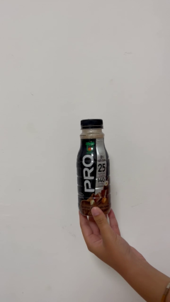
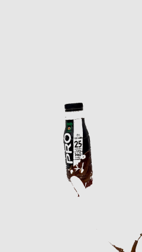

# HandHeld Object Modeling Using Neural Radiance Fields (NeRF)
We used the Nerfstudio opensource library to train the networks on the clouds.
the network can be trained locally using cuda on Nvidia GPUs.

Using a video \ set of images of a handheld object, we use image processing to extract the hand from the images and remove it, then we train the result frames on the cloud again using the nerfstudio library.
### steps
1. creating image frames out of an input video and resizing images.
2. running colmap on the images for preprocessing the data.
3. training the colmap output data using nerf.
4. creating a rendering result.

### Images Before Hand Extraction

### Images After Hand Extraction

### Rendering Result

